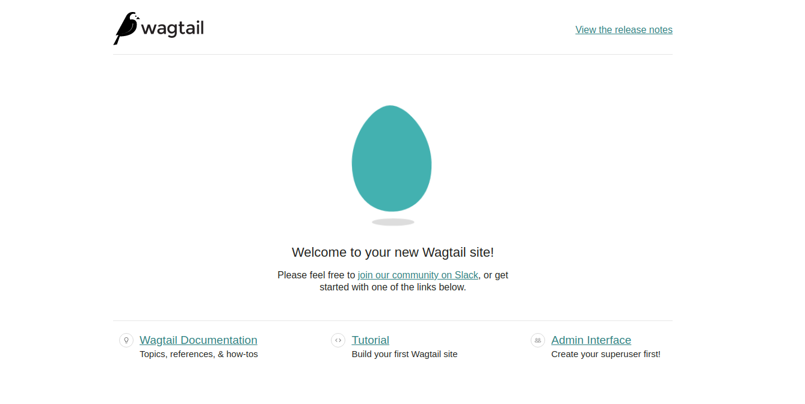
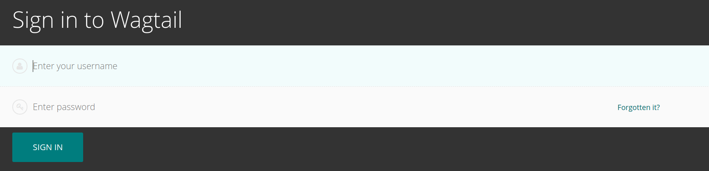

# Set up a local wagtail instance
Here we mostly abridge the [offical tutorial](https://docs.wagtail.io/en/stable/getting_started/tutorial.html). We assume that you are already in a directory you wish to create the wagtail project in.

1. Ensure that Python3 is installed locally `python3 --version`.
2. Ensure that venv is installed locally `pip3 install virtualenv`.
3. Create and activiate the virtual environment:
    ```sh
    python3 -m venv wagtailspike\env
    source wagtailspike\env\bin\activate
    ```
4. Install wagtail within the virtual environment. `pip install wagtail`.
5. Create a wagtail app `wagtail start mysite`
6. Install dependencies for wagtail:
    ```sh
    cd wagtailspike && pip install -r requirements.txt
    ```
7. Initialise a SQLite database `python3 manage.py migrate`.
8. Create an admin user for the playground `python3 manage.py createsuperuser`.
9. Start the server `python3 manage.py runserver`.
​
[localhost:8000](http://localhost:8000) should now serve your wagtail instance, with the admin panel being accessible from [localhost:8000/admin](http://localhost:8000/admin).




## Some useful commands
### Creating migrations
```sh
python3 manage.py makemigrations
```
### Running migrations
```sh
python3 manage.py migrate