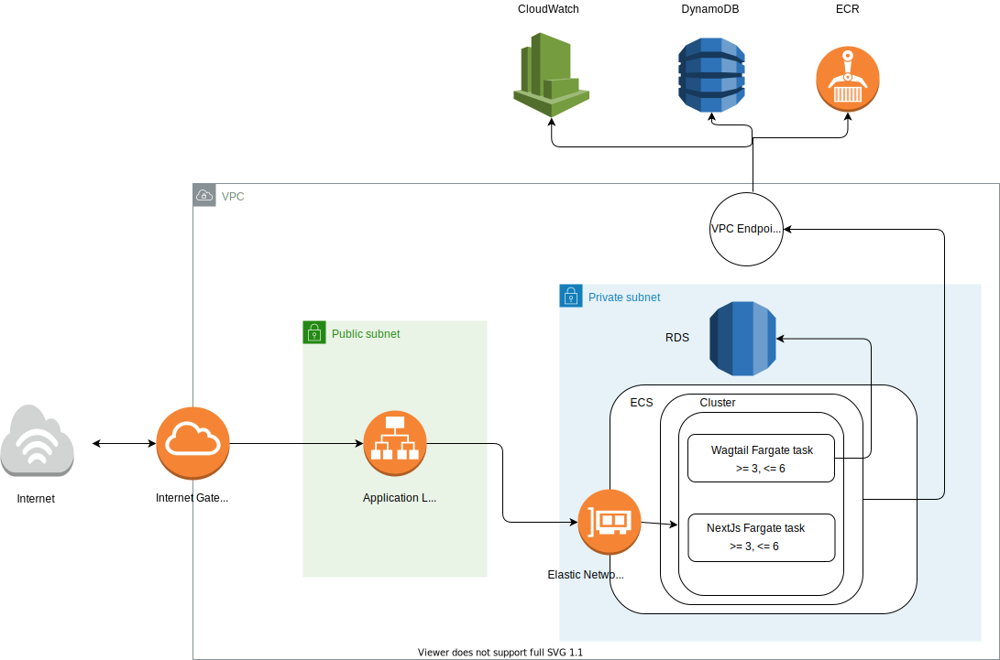

# Wagtail Infrastructure Requirements

## Table of Contents
- [Set up local repository](#set-up-local-repository)
- [Infrastructure](#infrastructure)
  * [Database](#database)
  * [Serverless](#serverless)
  * [Availability and Reliability](#availability-and-reliability)
- [Terrafrom](#terrafrom)
  * [The Wagtail Module](#the-wagtail-module)
    + [1. The RDS Instance](#1-the-rds-instance)
    + [2. Handling our connection](#2-handling-our-connection)
      - [Database Username and Password](#database-username-and-password)
      - [IAM Authentication](#iam-authentication)
  * [3. The ECS task](#3-the-ecs-task)
    + [1. Create the ECS_Cluster outside of the module](#1-create-the-ecs-cluster-outside-of-the-module)
    + [2. Make the ecs module more generic and flexible](#2-make-the-ecs-module-more-generic-and-flexible)
    + [Example variables file](#example-variables-file)
    + [Example of how this may look inside our project](#example-of-how-this-may-look-inside-our-project)

## Set up local repository
A local Docker setup which makes use of Wagtail and Postgres is available from this repository for Local Development and Testing, e.g. to get used to Wagtail, testing, and exploring the API. This should only be used for local testing, and is a precursor to an version we can have of the actual Wagtail instance that will be used for proper dev and production. 

See Wagtail_Local_Setup Folder, or view the [README](wagtail_local_setup/README.md)
## Infrastructure
To accommodate Wagtail we will require an RDS instance, and a new Fargate task. We would advise that this task be run on the same cluster, but using a different service and task. As the RDS is only to be used by wagtail instances, we can provision it within the same private subnet as our ECS tasks.

This results in our infrastructure now looking like this:

_If you wish to edit the above, please use the associated [XML file](./DrawIO_xml/infrastructure_diagram.xml)._


### Database
Wagtail natively supports both MySQL and PostgreSQL, so we will require one of these to be able to support our wagtail instance. Wagtail does also provide an "improved" backend for PostgresSQL, providing some methods that MySQL cannot use, due to this we should opt for a PostgresSQL based solution.

Recently, a discussion has been had that we may need to trigger an AWS lambda when entires are created or updated within Wagtail. This causes a lead towards using an Aurora PostgresSQL-Compatible database. This would allow us to trigger lambdas directly from database changes/updates, rather than needing an event system to be implemented. Aurora also boasts higher performance and availability over traditional RDS Postgres instances.

Whilst on the topic of Aurora, we could also consider using serverless Aurora; however, this loses the benefit of being able to use native SQL functions to trigger lambdas.

### Serverless
As we are able to containerize our wagtail project we can now run it inside of ECS. We have found no evidence that indicates that we cannot use a Fargate task, so it is believed that we can agree to this being a serverless solution.
Additionally, as we will potentially be using an Aurora RDS instance, we could also opt to use Aurora serverless for our database; however, this cannot trigger lambdas from SQL functions natively and requires an SNS topic to be added, removing an initial use case of moving towards Aurora.


### Availability and Reliability
As Wagtail itself will be hosted as a Fargate task, we can spread the task over multiple availability zones to ensure an outage does not effect our service. Additionally, as fargate takes a rolling deployment approach when docker images are updating, there should be no downtime when deploying new versions of our application.

Aurora stores copies of the data in a DB cluster across multiple Availability Zones in a single AWS Region, and synchronously replicates data between these when updated. Additionally, Aurora provides automatic failover, so if an issue occurred within the Primary node, a read replica would become promoted, avoiding database downtime.

## Terrafrom

_All terraform code within this section are examples and not necessarily production ready. Many values will be substituted with "stub" style values that will be defined post spike, as we focus on the main sections of infrastructure that is required. Security Groups and routing will not be considered at this point._

### The Wagtail Module

The Terraform for Wagtail revolves around two major resources, the Wagtail instance, which we will run via ECS, and the supporting RDS instance. Here we will focus on how to spin those, and their supporting resources up.

#### 1. The RDS Instance
The first note is that we do not currently have an RDS module, due to this, it is suggested that we use the [rds-aurora module from AWS](https://registry.terraform.io/modules/terraform-aws-modules/rds-aurora/aws/latest). This module will provide all resources that we need, whilst allowing to be used in a re-usable manner. Additionally, this module makes it swapping between engines and snapshots fairly simple.

Using this module, we can first create an RDS module that is somewhat like this:

```Terraform
    module "wagtail_rds_instance" {
        source  = "terraform-aws-modules/rds-aurora/aws
        version = "~> 2.0"

        name            = "${var.region}-${var.stage}-wagtail-rds"
        engine          = "aurora-postgresql"
        engine_version  = "11.9"
        instance_type   = "db.t3.medium"

        database_name   = "wagtail"
        port            = local.wagtail_port

        deletion_protection = true

        iam_database_authentication_enabled = true

        iam_roles = [var.wagtail_rds_iam_role]

        vpc_id = var.private_subnet_id
        subnets = var.subnets

        replica_count                   = 1
        allowed_security_groups         = [var.wagtail_ecs_sg]
        allowed_cidr_blocks             = [var.wagtail_cidr_range]

        storage_encrypted               = true
        apply_immediately               = true
        monitoring_interval             = 10

        db_parameter_group_name         = "default"
        db_cluster_parameter_group_name = "default"

        enabled_cloudwatch_logs_exports = ["postgresql"]

        tags = {
            Environment = "${var.stage}"
        }
    }
```

The above does not fully explore the features that we may make use of, but provides a good basis. For more information on the values we can provide, see [this variables file](https://github.com/terraform-aws-modules/terraform-aws-rds-aurora/blob/master/variables.tf).

#### 2. Handling our connection

With the database present, we have two options available:

1. IAM Authentication
2. Database Username and Password

The prior is preferred as it means no passwords are passed between our infrastructure; however, this relies on an HTTPS connection being present.

##### Database Username and Password

To enable the later instead, we need to create SSM env values (using secure strings) and allow the ECS task to access these. The outputs required can be found within the earlier mentioned RDS module.

When creating the ECS task, these will need to be passed into the template file, as we have done with values within the existing cymph_app.

##### IAM Authentication

_We will need to enable IAM Authentication within Wagtail for this to work, information on this can be found [here](https://medium.com/@bharath_52322/connecting-to-postgresql-rds-from-django-using-aws-iam-role-65f2d274d86f)_

To make use of IAM Authentication, we first need to ensure that our RDS modules has `iam_database_authentication_enabled = true`.

We will also then need to create a user within the database that we can allow iam access to, the script command required will look like this:

```sql
CREATE USER db_userx;
GRANT rds_iam TO db_userx;
```

However, to run this, we will need to look into running a [local-exec](https://www.terraform.io/docs/language/resources/provisioners/local-exec.html) the first time that the instance is created.

Once we have done this, we simply allow access to the created db user on our policies. More information can be found [here](https://docs.aws.amazon.com/AmazonRDS/latest/UserGuide/UsingWithRDS.IAMDBAuth.IAMPolicy.html). and the typical statements should look like this:

```json
"Statement": [
      {
         "Effect": "Allow",
         "Action": [
             "rds-db:connect"
         ],
         "Resource": [
             "arn:aws:rds-db:${local.region}:{local.account-number}:dbuser:{db-cluster-id}/db_userx",
         ]
      }
   ]
```

### 3. The ECS task

First, we will need to create a new ECR resource that we can push our image to, as we already have an ECR module, this should not be problematic.

The task definition should not change drastically from our current cymph_app.json. Unfortunately, at this time the ECS module itself is fairly tightly coupled to this specific config file, so we will need to take time to decouple these.

The main work of this decoupling exercise would be to:

1. Allow for dynamic policies to be provided, this will allow us to prevent all ECS tasks from having access to RDS, Dynamo, etc., allowing Wagtail and current cymph tasks to only have access to the resources they need.
2. Allowing for different template files to be passed into the module. The module currently only allows the specific template file to be used to define our container_definition.
3. Potentially provide a separation between clusters and tasks, allowing us to create a cluster with multiple task definitions.

To achieve this, we would first suggest doing the following:

#### 1. Create the ECS_Cluster outside of the module
The cluster itself is very minimal to set-up, as shown here:
```terraform
resource "aws_ecs_cluster" "main" {
  name = local.cluster_name
}
```
It is suggested that we create this at the component level and provide the needed outputs to any modules that require it. This allows us to use multiple tasks and services within the same cluster.

#### 2. Make the ECS module more generic and flexible
Currently, the module requires three input variables: `label_id`, `cluster_config`, and `task_config`. The first change required would be to also allow an input for `aws_cluster_name`, to allow us to pass the now externally created cluster into the module.

The next instance of tight coupling is the dependency on the app template_file using `template = file("./templates/cypmh_app.json.tpl")`, instead we would suggest that the template_file is created outside of the module and that the rendered output is passed into the module instead. This will allow our module to be used for any template file, and therefore any task definition we wish in future. In this case we can provide a file for cymph and another for wagtail.

Finally, as the module also creates policies, we run into the risk of tasks having privileges that they do not need breaking the Principle of least Privilege. To resolve this, it is suggested that we keep policies that will be shared by all ECS tasks inside of the module (e.g. assume_role, ECR, and logging policies). Next we create another input variable to provide the arn of an externally created policies containing the more specific actions of the task, and attach this to the roles created inside of the module.

#### Example variables file
Following this method, the variables file of the updated ecs module may look like this:
```Terraform
    variable "label_id" {
        type = string
        description = "The label to use within the module."
    }

    variable "cluster_config" {
        description = "An object containing values for cluster set-up." # We can include the cluster name here.
    }

    variable "task_config" {
        description = "An object containing values for task set-up"
    }

    variable "additional_policy_arn" {
        type = string
        description = "The arn of a policy containing additional accesses needed by this task."
    }

    variable "task_rendered_template_file {
        description = "The rendered template file to be used by the task definition."
    }

```

#### Example of how this may look inside our project

Here is an example of how the ECS tasks may look inside of our Terraform:

```Terraform
resource "aws_ecs_cluster" "main" {
  name = local.cluster_name
}

module "ecs_cymph" {
  source                        = "../modules/ecs"
  label_id                      = local.label_id
  cluster_config                = local.cluster_config
  task_config                   = local.task_config
  additional_policy_arn         = aws_iam_policy.cymph_fargate.arn
  task_rendered_template_file   = data.template_file.cymph.rendered
}

module "ecs_wagtail" {
  source                        = "../modules/ecs"
  label_id                      = "${local.label_id}-wagtail"
  cluster_config                = local.cluster_config_wagtail
  task_config                   = local.task_config_wagtail
  additional_policy_arn         = aws_iam_policy.wagtail_fargate.arn
  task_rendered_template_file   = data.template_file.wagtail.rendered
}

```
